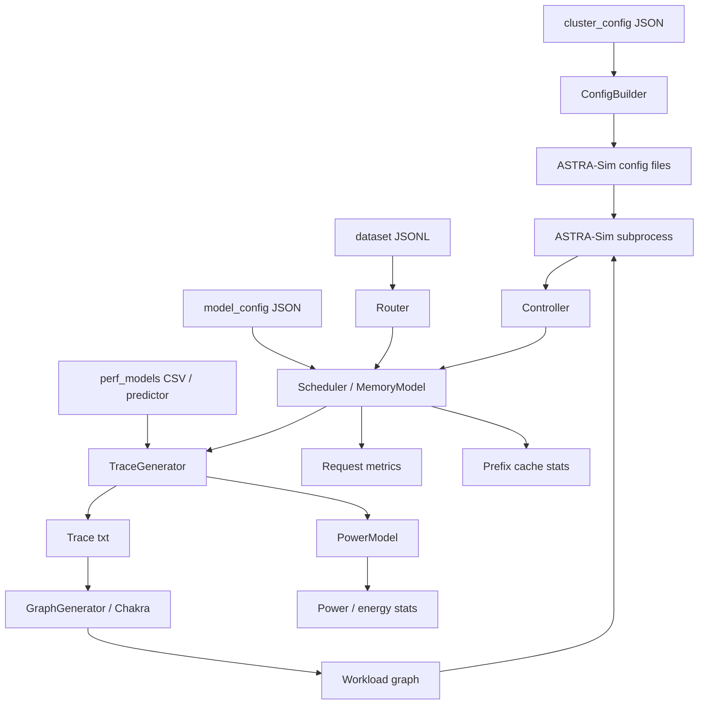

# LLMServingSim 框架工作流文档

## 1. 文档目标

本文档面向首次接触 LLMServingSim 的开发者，结合项目源码、根目录 `README.md` 以及相关论文，对框架的整体架构、端到端工作流、核心模块职责和关键设计思想进行系统性梳理。

本文关注的代码主线以 [`main.py`](/d:/LLMServingSim/main.py) 为入口，覆盖以下核心目录：

- [`inference_serving/`](/d:/LLMServingSim/inference_serving)
- [`cluster_config/`](/d:/LLMServingSim/cluster_config)
- [`dataset/`](/d:/LLMServingSim/dataset)
- [`llm_profile/`](/d:/LLMServingSim/llm_profile)
- [`astra-sim/`](/d:/LLMServingSim/astra-sim)

## 2. 项目定位与论文视角

LLMServingSim 的目标不是做一个“只看单层算子”的微基准工具，而是提供一个面向 LLM 推理服务系统的端到端系统级模拟框架。它把真实服务系统中的请求到达、批处理调度、KV Cache 演化、跨设备通信、异构内存访问以及能耗行为统一纳入一个工作流。

结合两篇论文，可以把项目演化概括为两个阶段：

- **LLMServingSim (IISWC 2024)**：提出“按 iteration 粒度模拟 LLM serving”的总体框架，强调利用自回归推理中的重复结构，避免传统加速器模拟器逐层、逐 token 重复仿真导致的超高成本。
- **LLMServingSim 2.0 (CAL 2025)**：在原框架上进一步强化“异构硬件可扩展性”和“现代 serving 技术覆盖面”，新增或强化了 MoE、Prefill/Decode 解耦、前缀缓存、CXL/PIM、功耗建模、实时 attention 预测等能力。

从论文视角看，这个框架最核心的设计思想有三点：

1. **Iteration-level simulation**：以服务迭代为主单位，而不是把整套软件栈逐条指令或逐 token 细粒度重演。
2. **Trace-driven performance modeling**：先用 profiler 获得硬件/模型组合上的层级时延，再由模拟器按 batch 生成执行 trace，交给 ASTRA-Sim 处理通信与系统协同。
3. **Flexible hardware integration**：通过“模型配置 + profiler 输出 + trace 生成器”三段式接口，将新增硬件的接入成本从“深改系统模拟器”降为“补 profile 数据并复用统一工作流”。

## 3. 框架整体架构

### 3.1 高层结构

从高层看，LLMServingSim 可以分成五层：

1. **输入层**
   - `cluster_config/*.json`：描述节点、实例、NPU 分组、CPU/CXL/PIM 内存、功耗参数和放置策略。
   - `dataset/*.jsonl`：描述请求到达时间、输入长度、输出长度、token 序列等。
   - `model_config/*.json`：描述模型结构参数，如层数、hidden size、expert 数量等。
   - `llm_profile/perf_models/...`：描述某硬件-模型组合下的层级性能数据与 attention 预测数据。

2. **控制与调度层**
   - `main.py`
   - `Router`
   - `Scheduler`
   - `MemoryModel`

3. **trace / graph 生成层**
   - `trace_generator.py`
   - `graph_generator.py`
   - Chakra converter

4. **系统仿真层**
   - ASTRA-Sim
   - analytical / ns3 网络后端

5. **结果汇总层**
   - 请求级时延指标：TTFT、TPOT、ITL、Latency
   - 系统级指标：throughput、功耗、能耗、prefix hit ratio
   - artifact evaluation 工作流

### 3.2 架构关系图

## 4. 端到端工作流程

本节按照代码真实执行路径说明系统如何从输入走到输出。

### 4.1 启动阶段

入口是 [`main.py`](/d:/LLMServingSim/main.py)。

启动时，主程序会：

1. 进入 `astra-sim/` 目录运行，统一相对路径基准。
2. 解析命令行参数，例如：
   - `--cluster-config`
   - `--dataset`
   - `--request-routing-policy`
   - `--enable-prefix-caching`
   - `--enable-attn-offloading`
   - `--network-backend`
3. 打印运行配置并初始化 logger。

这一阶段的关键结果是：将一次“实验任务”从命令行参数转化为一组内部控制变量。

### 4.2 集群配置构建

随后 `main.py` 调用 `build_cluster_config(...)`，由 [`inference_serving/config_builder.py`](/d:/LLMServingSim/inference_serving/config_builder.py) 完成以下工作：

1. 读取 `cluster_config/*.json`。
2. 校验节点、实例、内存、功耗和 PIM 配置的完整性。
3. 生成 ASTRA-Sim 所需的配置文件：
   - `astra-sim/inputs/network/network.yml`
   - `astra-sim/inputs/system/system.json`
   - `astra-sim/inputs/memory/memory_expansion.json`
4. 建立关键映射关系：
   - `inst2node_mapping`
   - `inst2npu_mapping`
   - `npu2inst_mapping`
5. 解析实例的 `pd_type`，区分 colocated / prefill / decode。
6. 解析 placement 规则，把“权重放在哪、KV evict 到哪、哪些层走不同存储层”转为统一内部表示。
7. 若启用 PIM，加载 PIM 设备参数并覆盖 CPU memory 参数中的带宽/时延。

这里的本质是把“用户视角的服务部署描述”翻译成“模拟器视角的系统拓扑与内存/通信配置”。

### 4.3 请求注入与实例分发

`main.py` 接着创建：

- 每个实例一个 `Scheduler`
- 全局一个 `Router`
- 可选的 `PowerModel`
- 一个 `Controller`

如果指定了数据集路径，`Router.generate(...)` 会读取 `dataset/*.jsonl` 中的请求流，并根据路由策略将请求注入 prefill 侧调度器：

- `RR`：轮询
- `RAND`：随机
- `CUSTOM`：留给开发者扩展

每个请求会被封装为 `Request` 对象，携带：

- 请求 ID
- 模型名
- 当前输入长度
- 最终输出长度
- 到达时间
- 所属实例
- 前缀缓存匹配所需的 token id 列表（若启用前缀缓存）

注意一个细节：如果系统使用 P/D 解耦，数据集请求首先只会被送入 **prefill 实例**；prefill 完成后，再由 `Router.transfer_prefill_request(...)` 送入 decode 实例。

### 4.4 ASTRA-Sim 初始化

在真正开始仿真前，主程序会先生成一个“事件型 workload”，让 ASTRA-Sim 的事件循环先启动起来：

1. `generate_event(...)` 生成事件 trace。
2. `generate_graph(..., event=True)` 把事件 trace 转成 Chakra graph。
3. `get_workload(..., event=True)` 获取 workload 路径。
4. 启动 ASTRA-Sim 子进程。

此后 Python 端和 ASTRA-Sim 端通过 `Controller` 进行同步。

### 4.5 主仿真循环

主循环是整个框架的核心。每一轮循环代表“某个 NPU 完成了一次 iteration，控制权返回 Python 调度器”。

循环内部大致按以下顺序执行：

1. **读取 ASTRA-Sim 输出**
   - `Controller.read_wait(...)`
   - `Controller.parse_output(...)`
   - 获取 `sys`、`id`、`cycle`

2. **定位当前完成工作的实例**
   - `sys -> instance_id -> node_id`

3. **更新功耗状态**
   - 若实例当前处于等待状态，统计 NPU standby energy

4. **回收已完成 batch**
   - `Scheduler.add_done(...)`
   - 更新请求状态
   - 更新 TTFT / ITL / Latency
   - 回收或固化 KV Cache
   - 若是 prefill 实例，已完成请求会移交 decode 实例

5. **尝试调度下一批请求**
   - `Scheduler.schedule(...)`
   - 若返回 `Batch`，说明当前实例可以发起下一轮推理

6. **为新 batch 生成 trace 与 graph**
   - `generate_trace(...)`
   - `generate_graph(...)`
   - 获取新的 workload 路径并写给 ASTRA-Sim

7. **周期性打印系统指标**
   - 吞吐
   - NPU / CPU / CXL 内存利用率
   - Prefix cache hit ratio
   - 当前功耗

8. **判断是否结束**
   - 若所有实例都没有待处理请求且 inflight batch 清空，则发送 `exit`，结束仿真

### 4.6 请求调度细节

`Scheduler` 是最关键的运行时模块之一。它的核心职责是：在给定当前时刻、实例状态和内存余量的条件下，决定“哪些请求能组成下一批 batch”。

其工作逻辑可以概括为：

1. 从到达时间不晚于当前时刻的请求中选可调度请求。
2. 受 `max_batch` 与 `max_num_batched_tokens` 约束裁剪 batch。
3. 若启用 `prioritize_prefill`，优先选择 prefill 请求。
4. 调用 `MemoryModel` 评估本轮需要新增的 KV cache 空间。
5. 若显存不足：
   - 非 prefix 模式下，把部分 decode 请求的 KV cache 驱逐到 CPU；
   - prefix 模式下，优先尝试通过 prefix hit 减少新增 KV，再必要时淘汰 prefix cache 或 evict 旧请求。
6. 构造 `Batch` 对象，记录：
   - `total_len`
   - `kv_len`
   - `hit_len`
   - `num_prefill`
   - `num_decode`
   - `q_list / k_list`
   - `evict/load` 大小

这里体现了框架和真实 serving 系统的一致性：**调度不仅受请求队列影响，也受 KV cache 空间、前缀命中、分批 token 上限和实例并行度共同约束。**

### 4.7 Trace 生成

`generate_trace(...)` 是连接“调度决策”和“系统仿真”的桥梁。

它会依据当前 batch、硬件 profile、模型结构和系统配置，生成一份文本 trace，描述本轮 iteration 中该实例的层级执行序列。

其输入包括：

- `Batch`
- 硬件类型与 NPU 数量
- tensor parallel 分组
- 实例类型（colocated / prefill / decode）
- placement 规则
- prefix cache 命中信息
- PIM / attention predictor / sub-batch interleaving 开关

Trace 生成时主要会完成以下事情：

1. 从 `llm_profile/perf_models/...` 中读取层级时延数据库。
2. 按模型结构展开一轮推理中会执行的层：
   - embedding
   - q/k/v
   - rope
   - attention
   - o_proj
   - FFN 或 MoE expert
   - final layernorm
   - lm_head
3. 用 `calculate_sizes(...)` 估算每层输入、权重、输出和通信量。
4. 对 tensor parallel 插入 `ALLREDUCE`。
5. 对 MoE expert parallel 插入 `ALLTOALL`。
6. 若启用 PIM，把 decode attention 拆给 PIM channel。
7. 若启用实时 attention 预测，则用 sklearn predictor 替代固定表查找。
8. 若启用 sub-batch interleaving，则把 batch 拆成两个子批以重叠执行。
9. 若启用 power model，则同步记录层执行、DRAM 访问和链路传输的能耗。

可以把它理解为：**调度器决定“跑什么 batch”，trace generator 决定“这个 batch 在硬件上表现成什么层序列与通信模式”。**

### 4.8 Graph 转换与 ASTRA-Sim 协同

Trace 文本文件只是中间表示。真正提交给 ASTRA-Sim 的是 Chakra graph。

这个阶段由 [`inference_serving/graph_generator.py`](/d:/LLMServingSim/inference_serving/graph_generator.py) 完成：

1. 调用 Chakra converter。
2. 把 `inputs/trace/...txt` 转成 `inputs/workload/.../llm` 图结构。
3. ASTRA-Sim 根据 workload graph、system config、network config、memory config 推进本轮仿真。

Python 端并不自己计算网络与系统时间，而是把层、通信、数据放置转成统一图，再交由 ASTRA-Sim 后端执行。这也是整个框架的系统级可信度来源。

### 4.9 完成态与结果输出

当所有请求完成后，主程序会统一汇总结果：

- 总请求数
- 总模拟时钟
- 总时延
- Prompt / Generation / Total token throughput
- Prefix cache 统计
- 总能耗与分组件能耗
- 每个实例的 TTFT / TPOT / ITL 均值、中位数、p99

若指定 `--output`，则每个实例还会把逐请求指标写入 CSV。

最终输出分为三类：

1. **终端汇总指标**
2. **逐请求 CSV**
3. **中间产物**
   - `astra-sim/inputs/trace/...`
   - `astra-sim/inputs/workload/...`
   - ASTRA-Sim 配置文件

## 5. 核心模块说明

### 5.1 主流程模块

| 模块 | 主要功能 | 输入 | 输出 | 交互对象 |
| --- | --- | --- | --- | --- |
| `main.py` | 组装全流程、驱动仿真主循环 | CLI 参数、配置文件、数据集 | 终端指标、CSV、trace/workload | ConfigBuilder、Router、Scheduler、TraceGenerator、GraphGenerator、Controller、PowerModel、ASTRA-Sim |
| `config_builder.py` | 解析 cluster config 并生成 ASTRA-Sim 配置 | `cluster_config/*.json` | cluster 元数据、network/system/memory 配置文件 | main、trace_generator |
| `controller.py` | Python 与 ASTRA-Sim 子进程的同步控制 | ASTRA-Sim stdout/stdin | 解析后的迭代完成事件 | main |

### 5.2 请求与调度模块

| 模块 | 主要功能 | 输入 | 输出 | 交互对象 |
| --- | --- | --- | --- | --- |
| `request.py` | 定义请求和 batch 的状态数据结构 | 请求元信息 | `Request` / `Batch` 对象 | Router、Scheduler、TraceGenerator |
| `router.py` | 按策略分发请求；处理 P/D 解耦下 prefill -> decode 转移 | 数据集、路由策略 | 注入各 Scheduler 的请求流 | Scheduler |
| `scheduler.py` | 连续批处理调度、队列管理、batch 构造、完成态回收 | 当前时钟、实例状态、请求队列 | 可执行 `Batch` 或完成请求列表 | MemoryModel、Router、TraceGenerator |

### 5.3 内存与缓存模块

| 模块 | 主要功能 | 输入 | 输出 | 交互对象 |
| --- | --- | --- | --- | --- |
| `memory_model.py` | 估算权重/KV 占用，维护 NPU/CPU/CXL 内存状态 | 模型配置、batch 请求、placement | 空间可用性判断、分配/释放结果、prefix hit 信息 | Scheduler、TraceGenerator |
| `radix_tree.py` | 提供 token 级 prefix cache 的底层数据结构 | token id 序列 | 命中长度、可驱逐块、事件流 | MemoryModel |

### 5.4 执行建模模块

| 模块 | 主要功能 | 输入 | 输出 | 交互对象 |
| --- | --- | --- | --- | --- |
| `trace_generator.py` | 把 batch 转成一轮 iteration 的层级 trace | Batch、模型结构、profile 数据、开关配置 | trace 文本文件 | GraphGenerator、PowerModel、GateRouter |
| `graph_generator.py` | 把 trace 转成 Chakra workload graph | trace 文件 | workload graph | Chakra、ASTRA-Sim |
| `gate_function.py` | 为 MoE expert 分配 token | expert 配置、路由策略、token 数 | 每个 expert 的 token 负载 | TraceGenerator |
| `pim_model.py` | 解析 PIM 设备参数 | PIM ini 文件 | 带宽、时延、功耗参数 | ConfigBuilder、TraceGenerator |
| `power_model.py` | 统计动态能耗与总功耗 | 层时延、数据移动大小、功耗配置 | 功耗时间序列、能耗汇总 | main、TraceGenerator |

### 5.5 Profile 支撑模块

| 模块 | 主要功能 | 输入 | 输出 | 交互对象 |
| --- | --- | --- | --- | --- |
| `llm_profile/` | 采集硬件-模型组合下的层时延、attention 时延与功耗 | Hugging Face 模型、目标硬件 | `perf_models/...` 数据库 | TraceGenerator |

## 6. 数据流转路径

### 6.1 关键数据对象

系统中最重要的几类数据如下：

- **请求流数据**：来自 `dataset/*.jsonl`
- **集群部署数据**：来自 `cluster_config/*.json`
- **模型结构数据**：来自 `model_config/*.json`
- **性能模型数据**：来自 `llm_profile/perf_models/...`
- **运行时状态数据**：`Request`、`Batch`、prefix cache、内存占用、能耗累计值

### 6.2 数据路径

从输入到输出的数据路径可以概括为：

1. `cluster_config` 决定系统拓扑、实例布局、存储层级和功耗参数。
2. `dataset` 生成请求流，由 `Router` 分发到不同实例。
3. `Scheduler` 根据当前时钟、内存约束和策略组 batch。
4. `MemoryModel` 评估 KV/权重/前缀缓存命中和驱逐行为。
5. `TraceGenerator` 将 batch 展开为一轮迭代的层级执行 trace。
6. `GraphGenerator + Chakra` 将 trace 转为 ASTRA-Sim 可执行的 workload graph。
7. ASTRA-Sim 返回各 NPU 的 iteration 完成时间。
8. `Scheduler.add_done()` 将这些完成事件反映到请求状态中。
9. `main.py` 聚合形成系统级与请求级指标。

这条链路体现了该框架最重要的抽象边界：

- **上游**负责“请求与批次决策”
- **中游**负责“把批次编译成硬件执行与通信表示”
- **下游**负责“做真实的系统级时间推进”

## 7. 关键设计思想与实现原理

### 7.1 迭代级建模而非逐 token 重演

IISWC 2024 论文指出，传统模拟器对 LLM serving 的建模常忽视自回归推理中的动态 workload 变化，同时也没有利用 decoder block 之间高度重复的结构。LLMServingSim 的做法是把服务过程切成一次次 iteration，并在每次 iteration 只生成必要的层级 trace，再将其交给系统模拟器。

这带来两个直接收益：

- 能表达“batch 中 prefill 与 decode 混合存在”的动态状态。
- 能显著减少与底层硬件模拟器耦合的重复工作量。

### 7.2 Trace-driven 扩展接口

CAL 2025 论文强调了异构硬件接入难的问题。当前实现中，新增硬件大致只需完成三件事：

1. 在 `llm_profile/` 中采集该硬件上的层时延与 attention 数据。
2. 在 `cluster_config` 中引用新硬件名称。
3. 让 `trace_generator.py` 复用已有的层展开逻辑。

这也是 README 中“通过 profiler 扩展新模型和硬件”的技术基础。

### 7.3 调度与内存是第一公民

框架不是简单地把一个 batch 的算子顺序写死，而是把以下问题放在同等重要的位置：

- batch 是否能装下
- 是否需要 evict 旧 KV
- prefix cache 命中后本轮真正需要算多少 token
- prefill 与 decode 是否分开走不同实例
- expert token 如何分发

因此 `Scheduler + MemoryModel` 实际上承担了整个系统行为的“控制面”角色。

### 7.4 前缀缓存建模

前缀缓存不是单纯记录“命中/未命中”布尔值，而是通过 `RadixCache` 在 token 序列级别做前缀匹配，并维护：

- NPU 一级 prefix cache
- CPU / CXL 二级 prefix cache
- lock / unlock / evict 机制
- 事件流驱动的内存占用更新

这使得框架可以同时建模：

- 命中减少计算量
- 命中减少新增 KV cache
- 二级存储池化带来的共享收益
- 驱逐和回载带来的额外 DRAM/互连开销

### 7.5 异构执行路径：PIM、TP、MoE

`trace_generator.py` 是异构行为表达最集中的位置：

- **Tensor Parallel**：通过 `ALLREDUCE` 显式表示同步开销
- **MoE**：通过 `GateRouter` 分配 expert 负载，并用 `ALLTOALL` 表达 expert parallel 通信
- **PIM**：把 decode attention 分配到 PIM channel，形成远端执行路径
- **Sub-batch Interleaving**：把一个 batch 切成两个子批，在特定场景下重叠 XPU 与 PIM 工作

这部分是 LLMServingSim 2.0 相比前代最重要的能力增强之一。

### 7.6 功耗与能耗建模

功耗模型采用“基础静态功耗 + 运行时增量能耗”的组合：

- 基础部分：节点、NPU、CPU、DRAM、NIC、存储的 idle/base power
- 动态部分：NPU active、standby、DRAM 数据移动、链路数据移动、PIM active

因此它并不是做一个离线后处理，而是与 batch 生成和层执行过程同步更新。

## 8. 新开发者推荐阅读路径

如果你要快速理解代码，推荐按下面顺序阅读：

1. [`README.md`](/d:/LLMServingSim/README.md)
2. [`main.py`](/d:/LLMServingSim/main.py)
3. [`inference_serving/router.py`](/d:/LLMServingSim/inference_serving/router.py)
4. [`inference_serving/scheduler.py`](/d:/LLMServingSim/inference_serving/scheduler.py)
5. [`inference_serving/memory_model.py`](/d:/LLMServingSim/inference_serving/memory_model.py)
6. [`inference_serving/trace_generator.py`](/d:/LLMServingSim/inference_serving/trace_generator.py)
7. [`inference_serving/config_builder.py`](/d:/LLMServingSim/inference_serving/config_builder.py)
8. [`inference_serving/power_model.py`](/d:/LLMServingSim/inference_serving/power_model.py)
9. [`llm_profile/README.md`](/d:/LLMServingSim/llm_profile/README.md)

### 8.1 主调用链

可以把主调用链记成下面这条线：

`main.py`
-> `build_cluster_config`
-> `Router.generate`
-> `Scheduler.schedule / add_done`
-> `generate_trace`
-> `generate_graph`
-> `ASTRA-Sim`
-> `Controller.parse_output`
-> 返回 `Scheduler`

### 8.2 修改不同功能时该看哪里

- 想改请求分发策略：看 `router.py`
- 想改连续批处理逻辑：看 `scheduler.py`
- 想改显存/CPU/CXL 行为：看 `memory_model.py`
- 想支持新的模型结构：看 `memory_model.py` 的 `calculate_sizes` 和 `trace_generator.py` 的层展开逻辑
- 想支持新的硬件：看 `llm_profile/` 与 `perf_models/`
- 想改 PIM / prefix cache / MoE：看 `trace_generator.py`、`memory_model.py`、`gate_function.py`

## 9. 总结

LLMServingSim 的核心不是单个模块，而是它把以下三件事打通了：

1. **服务系统层的动态调度与缓存行为**
2. **硬件层的层级性能与异构执行路径**
3. **系统层的网络、内存和能耗协同仿真**

对新开发者而言，最值得先建立的心智模型是：

- `Router/Scheduler/MemoryModel` 决定“系统要跑什么”
- `TraceGenerator/GraphGenerator` 决定“这些请求如何被编译成可仿真的执行图”
- `ASTRA-Sim + Controller` 决定“这些图在系统层上花了多少时间”

理解了这三层，就基本理解了整个框架。

## 10. 参考资料

- 项目 README：[`README.md`](/d:/LLMServingSim/README.md)
- 项目 profiling 说明：[`llm_profile/README.md`](/d:/LLMServingSim/llm_profile/README.md)
- 论文 1：LLMServingSim: A HW/SW Co-Simulation Infrastructure for LLM Inference Serving at Scale  
  DOI: https://doi.org/10.1109/IISWC63097.2024.00012
- 论文 2：LLMServingSim2.0: A Unified Simulator for Heterogeneous Hardware and Serving Techniques in LLM Infrastructure  
  DOI: https://doi.org/10.1109/LCA.2025.3628325
